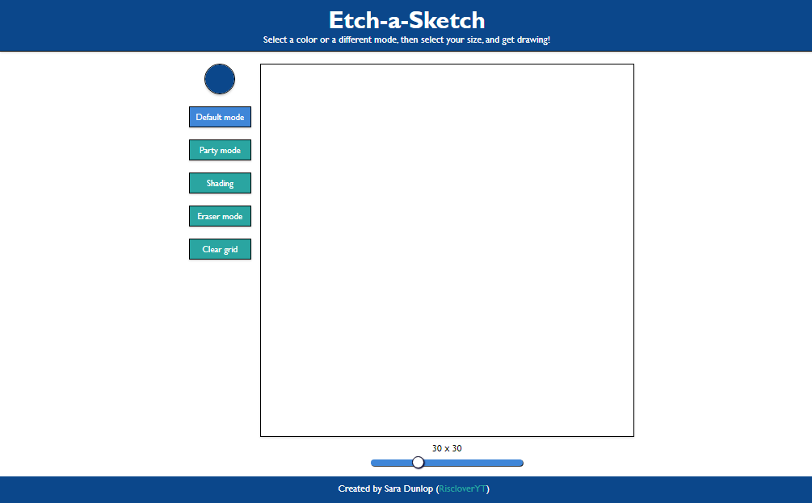
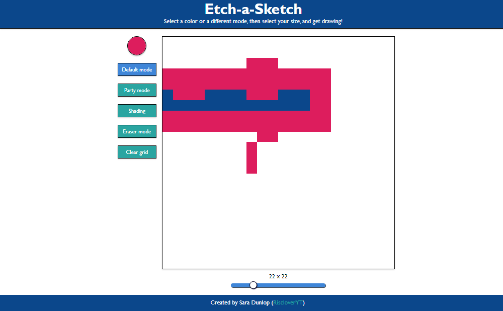
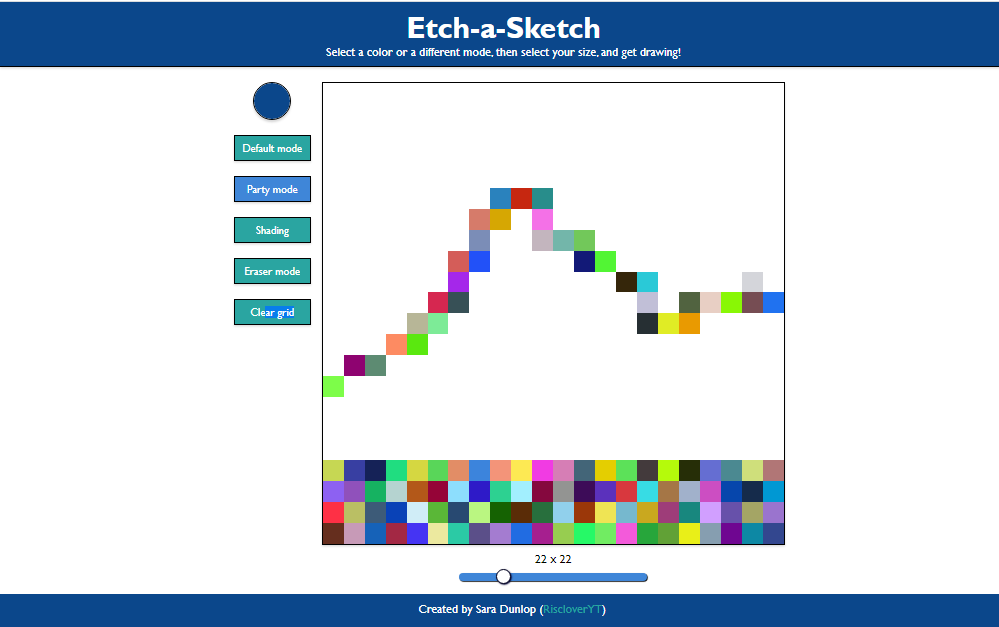
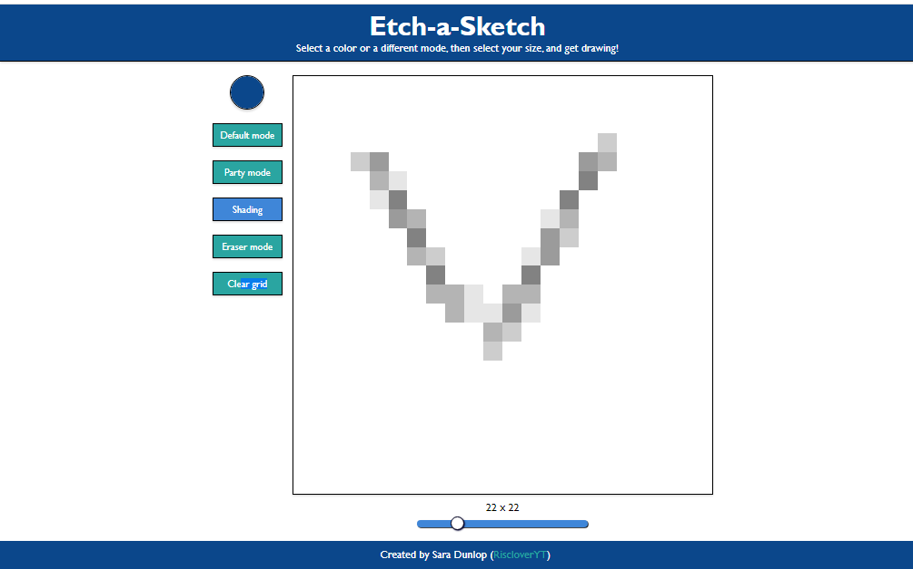

# Etch-a-Sketch

This etch-a-sketch is a browser-based drawing app in which the user is able to draw pretty pictures. It is named "Etch-a-Sketch" because, although it doesn't have the classic red etch-a-sketch design, the user uses their mouse to draw, meaning they must begin from the edge each time (just like with a real etch-a-sketch). 

This app features various drawing modes as well as the ability to change the grid (drawing pixel) size.

### Table of Contents
1. [Instructions](#Instructions)
    - [About Various Modes](#about-various-modes)
        - [Default Mode](#default-mode)
        - [Party Mode](#party-mode)
        - [Shading Mode](#shading-mode)
        - [Eraser Mode](#eraser-mode)
        - [Clear Grid](#clear-grid)

2. [About the Project](#about-the-project)
3. [Links](#links)

## Instructions
Use your mouse to draw pictures on the board by hovering your mouse over the board. 

### About Various Modes

#### Default Mode

The default mode is the mode in which the user can pick any color from the color picker.

#### Party Mode

The party mode is a fun mode in which the colors are randomly generated.

#### Shading Mode

"Shading" is a mode in which the color goes from white to black, one shade at a time, as the mouse goes over the pixel.

#### Eraser Mode

A mode in which the "color" is white, so going over previous work "erases" it.

#### Clear Grid

Select this to clear the grid, erasing all of your work.

## About the Project

This etch-a-sketch drawing app was created as a result of [The Odin Project's curriculum](https://www.theodinproject.com/) near the beginning of my JavaScript learning journey. 

### Technologies Used

1. HTML
2. CSS
3. JavaScript

### Blog Post

To read more about this project, you can visit my website and read the blog post dedicated to this project.

## Links

1. [Live Demo][https://risclover.github.com/etch-a-sketch)
2. [Code Repo](https://www.github.com/Risclover/etch-a-sketch)
3. [Project Breakdown](https://risclover.github.io/official-portfolio/blog/project_breakdown_etchasketch.html)
